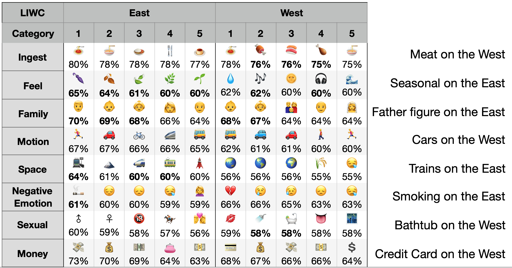

# Code Repository: Studying Cultural Differences in Emoji Usage across the East and the West

Welcome to the code repository that accompanies our submission at International AAAI Conference on Web and Social Media (ICWSM 2019)!

Code that generated the figures in our paper is consolidated into the `ICWSM2019.ipynb`.

We are exploring options in sharing our dataset, too, in order to help replicating our results.